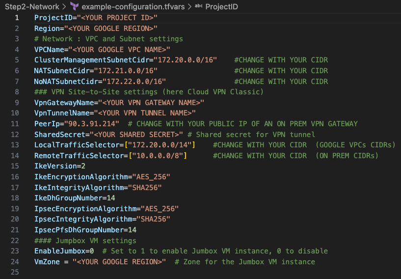
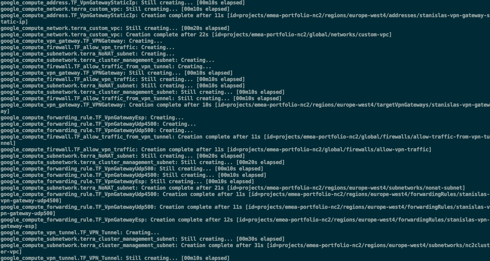
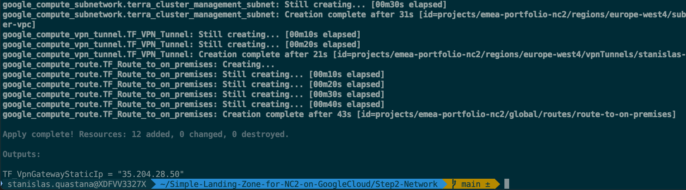
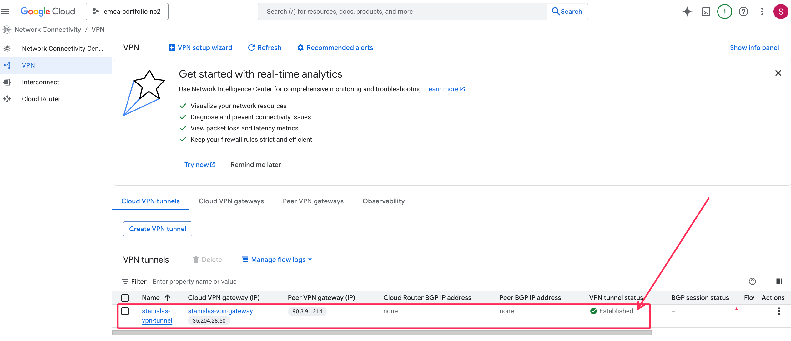
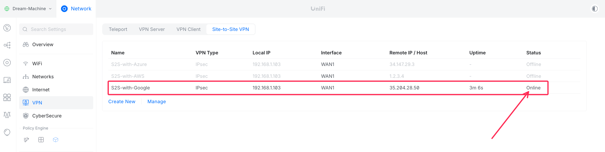
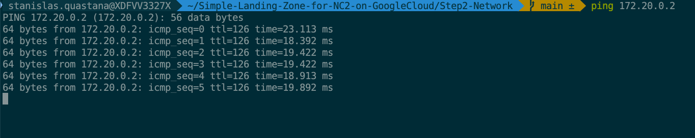

# Simple-Landing-Zone-for-NC2-on-GoogleCloud
This is a simple landing zone for Nutanix Cloud Clusters on Google Cloud Platform

This repo contains terraform code to deploy a **simple network landing zone for Nutanix Cloud Cluster (NC2) on Google Cloud with a VPN site to site connection to On-premises Datacenter** (using a Google Cloud Classic VPN)

 


## Prerequisites

- Of course a VPN Gateway running on premises (or on a public cloud platform)
- All prerequisites for NC2 : URL-TBD
- More information about NC2 on GCP : URL-TBD

- An Google Project with enough privileges (create Role, ...)
- Google Cloud CLI x.x. or > : https://cloud.google.com/sdk/docs/install-sdk 
    - [how to configure Google Cloud CLI with your project](https://cloud.google.com/sdk/docs/install-sdk#initializing_the)
- Terraform CLI 1.13 or > : <https://www.terraform.io/downloads.html>
    - [Best practices for using the Terraform Google Cloud Provider](https://cloud.google.com/docs/terraform/best-practices/general-style-structure)

You can also clone this repo in your [Google Cloud Shell](https://cloud.google.com/shell/docs) and [use terraform in your cloud shell](https://cloud.google.com/docs/terraform/install-configure-terraform).

For additional information about creating manually your ressources on Google Cloud for Nutanix Cloud Cluster : URL-TBD


# Step 1 - Service accounts and custom roles

NC2 on Google Cloud requires 2 Services Accounts with specifics permissions :
- one to be used by NC2 Portal (aka MCM)
    - More informations about permissions : UBD-URL
- one to used by GCE Metal instances of the cluster
    - More informations about permissions : UBD-URL


# Step 2 - Networking (will include Cloud VPN deployment)

## Landing Zone architecture(s)

This landing zone is designed for an NC2 on Google Cloud with **Nutanix Flow Networking** and a VPN Site to Site connexion with on premises (or other cloud) network.

  

IP ranges and **all variables** can be defined/customized by editing [example-configuration.tfvars](example-configuration.tfvars). Then rename example-configuration.tfvars to configuration.tfvars

This landing zone also include the option to have a dedicated private subnet and a virtual machine to use as a jumbox. All Google Cloud resources related to Jumbox are in [jumbox.tf](jumbox.tf) file.


## Step by step operations

Clone this repo.

Edit [example-configuration.tfvars](example-configuration.tfvars) to define your AWS resources names or tags, your AWS region, AMI for Jumpbox Virtual Machine... Then rename example-configuration.tfvars to configuration.tfvars

 

**Important** DO NOT USE 192.168.5.0/24 CIDR that is reserved for communications between AHV and the CVM


To get these information, you can use the [Google CLI](https://cloud.google.com/sdk/gcloud) on your workstation or in [Google Cloud Shell](https://cloud.google.com/shell/docs/launching-cloud-shell?hl=en)

You can list your Google regions available using the following command :

```bash
aws ec2 describe-regions --output table
```
 

The following command gives the region actually used by the CLI regardless of whether environment variables are or are not set:
https://cloud.google.com/sdk/gcloud/reference/config/set

```bash
gcloud...
```


If you don't need a Jumpbox VM and its associated resources, you can delete [jumbox.tf](jumbox.tf) file.

To get AMI ID  for the Windows Server Jumbox in the choosen region :

```bash
gcloud compute images list --project=windows-cloud --filter="name:windows-server-2025"
```

  


1. Terraform Init phase  

```bash
terraform init
```

2. Terraform Plan phase

```bash
terraform plan --var-file=configuration.tfvars
```

3. Terraform deployment phase (add TF_LOG=info at the beginning of the following command line if you want to see what's happen during deployment)

```bash
terraform apply --var-file=configuration.tfvars
```



4. Wait until the end of deployment (It should take around 18 minutes)



5. Get the Public IP used for VPN Tunnels on the Google VPN Gateway

On the Google Console : 


Then use this public IP in the on-premises VPN Gateway tunnel configuration.

Example using a Unifi Gateway : 


On AWS Console, check that the VPN Tunnel is up



On your on premises VPN Gateway management UI, check VPN Tunnel Status :




6. Deploy an GCE instance in the NC2 VPC (for example in the management subnet) to perform a connectivity test between Google network and on-premises network


Check the Security Group defined to open network communications from on premises


Ping the GCE instance from an on premises device and validate that VPN Site to site is up and running




7. Go to Nutanix Cloud Cluster (NC2) Portal [https://cloud.nutanix.com](https://cloud.nutanix.com) and start your Nutanix Cluster deployment wizard.

In Step 1 (**General**) choose the same Google region and Availability Zone that you used in your terraform deployment

 

In Step 4 (**Network**) choose the VPC and Management Subnets created with terraform


In Step 6 (**Prism Central**) choose the PC Subnet and FVN (Flow Virtual Networking) subnet created with terraform

 

8. After the deployment of the cluster is successfull, you can add connectivity with on-premises or other Google Cloud VPC or services by peering [a SharedVPC](https://cloud.google.com/vpc/docs/shared-vpc) or [a Hub] (https://cloud.google.com/network-connectivity/docs/network-connectivity-center/how-to/vpc-configure-hub). If you enabled a bastion and a Jumpbox VM, you can login to the Jumbox VM and connect Prism Element or Prism Central through a web browser.

9. Use the solution and configure Nutanix features like categories, VM, replication...

10. When you want to destroy the Nutanix Cluster, use the NC2 Portal (https://cloud.nutanix.com) to terminate it.

11. After Nutanix cluster terminaison, you can destroy the landing zone using the following command : 
```bash
terraform destroy --var-file=configuration.tfvars
```


## Check you AWS Console after deployment to see cloud resources created

### Network components

 

 

 


## How much does it cost to test this landing zone ?

It's cheap to test and customize this simple landing zone.

You can use **infracost** (available on https://www.infracost.io/) to check the estimate price for 1 month. Here is an example for Netherland (eu-west-4) Google Region without enabling a GCE Jumbox.

 

 :exclamation: Important : this landing zone cost estimation does not include the cost of Google GCE Metal instance(s) used as node(s) in the Nutanix Cluster and network traffic. 
 Please have a look of metal instances prices here : https://cloud.google.com/products/calculator?hl=en&dl=CjhDaVF3Tmprek1qVmpNUzAzWlRGaExUUXdZVGN0T0RrNE55MDVZVFZrTkRaaE56YzVPREVRQVE9PRAIGiREMUQ5QTgzOC00RjY1LTRGMkEtOEY5Qi1DMDlCQkUyRkI5Mzk . Pricing is per instance-hour consumed for each instance, from the time an instance is launched until it is terminated or stopped.


## Future improvements on my roadmap

- Add additional labels to every GCP resources 


